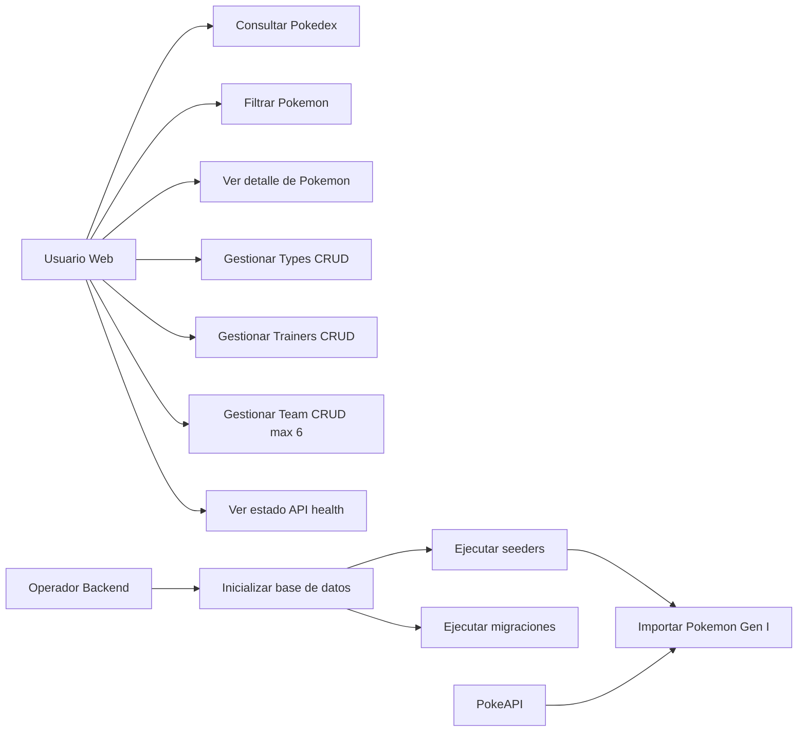
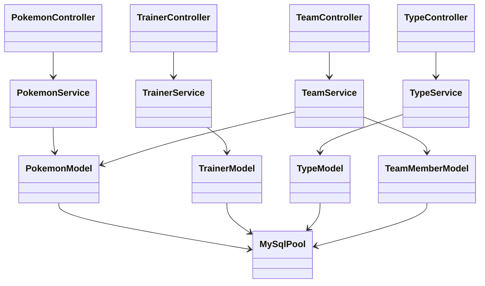

# Poke Team Lab

Aplicacion full stack inspirada en la Pokedex original (Gen I) con API REST, base de datos MySQL y frontend en React.

## Que incluye

- Backend Node.js + Express con CRUD de Pokemon, Trainers, Types y Team.
- Base de datos MySQL 8 con migraciones y seeders.
- Importador de Pokemon Gen I desde PokeAPI.
- Frontend React + Vite con rutas para Pokedex, Team Builder, Trainer Profiles y Type Insights.
- Docker Compose para levantar MySQL local.

## Stack tecnologico

| Capa | Tecnologias |
|------|-------------|
| Backend | Node.js 18+, Express 5, mysql2, dotenv, cors |
| Frontend | React 19, React Router 7, Vite 7 |
| Base de datos | MySQL 8 (Docker) |
| Testing | Jest + Supertest (backend, cobertura parcial) |

## Requisitos

- Node.js 18 o superior
- npm 10+
- Docker Desktop (recomendado para MySQL)

## Inicio rapido

1. Instala dependencias:

```bash
npm install --prefix backend
npm install --prefix frontend
```

2. Levanta MySQL con Docker:

```bash
docker compose up -d mysql
```

3. Configura variables de entorno:

- Copia backend/.env.example a backend/.env.
- Ajusta credenciales si cambiaste docker-compose.yml.
- Opcional:
   - DB_AUTO_MIGRATE=true
   - DB_AUTO_SEED=true

4. Ejecuta migraciones y seeders (si no usas auto-setup):

```bash
cd backend
npm run migrate
npm run seed
```

5. Inicia backend:

```bash
npm start
```

API disponible en http://localhost:4000.

6. Inicia frontend:

```bash
cd ../frontend
npm run dev
```

App disponible en http://localhost:5173.

## Scripts disponibles

### Backend (carpeta backend)

- npm start: inicia la API en produccion/local.
- npm test: ejecuta pruebas Jest.
- npm run migrate: aplica migraciones.
- npm run migrate:down: revierte migraciones.
- npm run seed: ejecuta seeders.

Nota: en este proyecto no existe script npm run dev en backend.

### Frontend (carpeta frontend)

- npm run dev: servidor de desarrollo Vite.
- npm run build: build de produccion.
- npm run preview: preview del build.
- npm run lint: revisa ESLint.

## API REST

Base URL: http://localhost:4000

Health check:
- GET /health

### Pokemon

- GET /api/pokemon
- GET /api/pokemon/:nationalDex
- POST /api/pokemon
- PUT /api/pokemon/:nationalDex
- DELETE /api/pokemon/:nationalDex

Filtros en GET /api/pokemon:
- search
- type
- types[]
- limit
- offset

Ejemplo de body para POST/PUT Pokemon:

```json
{
   "nationalDex": 25,
   "name": "pikachu",
   "height": 4,
   "weight": 60,
   "baseExperience": 112,
   "spriteUrl": "https://raw.githubusercontent.com/PokeAPI/sprites/master/sprites/pokemon/25.png",
   "types": ["electric"],
   "abilities": [{ "name": "static", "isHidden": false }],
   "stats": [{ "name": "speed", "base": 90 }],
   "trainerId": 1
}
```

### Trainers

- GET /api/trainers
- POST /api/trainers
- PUT /api/trainers/:id
- DELETE /api/trainers/:id

Ejemplo de body para POST/PUT Trainer:

```json
{
   "name": "Misty",
   "hometown": "Cerulean City",
   "badgeCount": 4,
   "bio": "Water specialist",
   "portraitUrl": "/trainers/misty.png"
}
```

### Types

- GET /api/types
- POST /api/types
- PUT /api/types/:id
- DELETE /api/types/:id

Ejemplo de body para POST/PUT Type:

```json
{
   "name": "fire",
   "color": "#EE8130",
   "description": "Specializes in offense"
}
```

### Team

- GET /api/team
- POST /api/team
- PUT /api/team/:id
- DELETE /api/team/:id

Reglas de negocio Team:
- Maximo 6 miembros.
- nationalDex obligatorio y entre 1 y 151.
- El Pokemon debe existir en la Pokedex local.

Ejemplo de body para POST/PUT Team member:

```json
{
   "nationalDex": 25,
   "nickname": "Sparky",
   "role": "sweeper",
   "notes": "Lead con Thunderbolt"
}
```

### Formato de respuestas

- Exito con payload: { "data": ... }
- Error: { "message": "..." }
- DELETE exitoso: HTTP 204 sin body (respuesta vacia)

## Pruebas

Hay pruebas automatizadas de CRUD para Types en backend/tests/types.crud.test.js.

Ejecutar:

```bash
cd backend
npm test
```

## Diagramas en el README

### Casos de uso



### Arquitectura de clases backend



### Entidad relacion (MySQL)

```mermaid
erDiagram
      TYPES {
            INT id PK
            VARCHAR name UNIQUE
            VARCHAR color
            TEXT description
      }

      TRAINERS {
            INT id PK
            VARCHAR name UNIQUE
            VARCHAR hometown
            TINYINT badge_count
            TEXT bio
            VARCHAR portrait_url
      }

      POKEMON {
            INT id PK
            INT national_dex UNIQUE
            VARCHAR name
            SMALLINT height
            SMALLINT weight
            SMALLINT base_experience
            VARCHAR sprite_url
            JSON types_json
            JSON abilities_json
            JSON stats_json
            INT trainer_id FK
      }

      TEAM_MEMBERS {
            INT id PK
            INT national_dex FK
            VARCHAR nickname
            VARCHAR role
            VARCHAR notes
      }

      TRAINERS ||--o{ POKEMON : trainer_id
      POKEMON ||--o{ TEAM_MEMBERS : national_dex
```

## Estructura del proyecto

```text
backend/              API Express, modelos, servicios, migraciones y seeders
frontend/             App React con Vite
docs/                 Documentacion complementaria
docker-compose.yml    MySQL local en Docker
```

## Documentacion adicional

- docs/casos-de-uso.md
- docs/clases.md
- docs/entidad-relacion.md
- docs/diagrams.md
