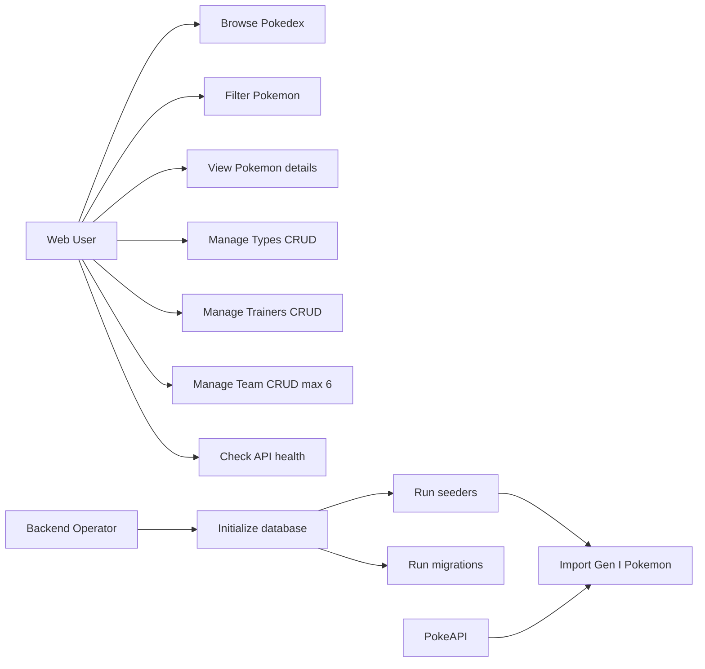
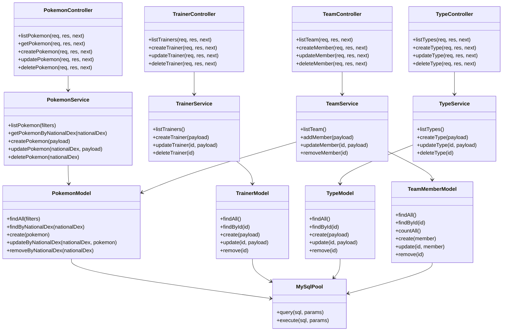
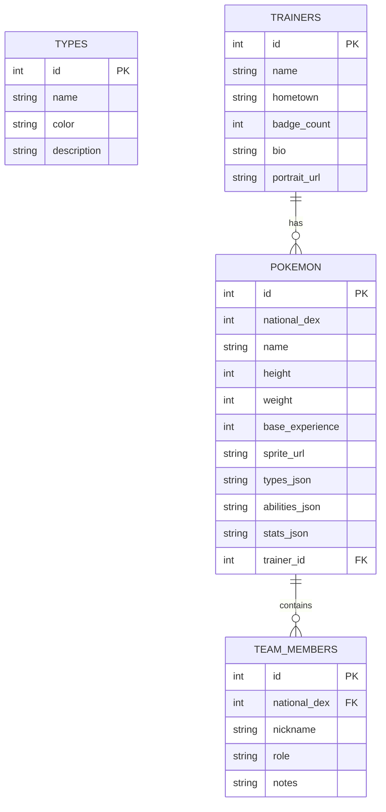

# Poke Team Lab

Full-stack application inspired by the original Gen I Pokedex, built with a REST API, MySQL, and a React frontend.

## What is included

- Node.js + Express backend with CRUD for Pokemon, Trainers, Types, and Team.
- MySQL 8 database with migrations and seeders.
- Gen I Pokemon importer from PokeAPI.
- React + Vite frontend with routes for Pokedex, Team Builder, Trainer Profiles, and Type Insights.
- Docker Compose setup for local MySQL.

## Tech stack

| Layer | Technologies |
|------|-------------|
| Backend | Node.js 18+, Express 5, mysql2, dotenv, cors |
| Frontend | React 19, React Router 7, Vite 7 |
| Database | MySQL 8 (Docker) |
| Testing | Jest + Supertest (backend, partial coverage) |

## Requirements

- Node.js 18 or newer
- npm 10+
- Docker Desktop (recommended for MySQL)

## Quick start

1. Install dependencies:

```bash
npm install --prefix backend
npm install --prefix frontend
```

2. Start MySQL with Docker:

```bash
docker compose up -d mysql
```

3. Configure environment variables:

- Copy backend/.env.example to backend/.env.
- Adjust credentials if you changed docker-compose.yml.
- Optional flags:
  - DB_AUTO_MIGRATE=true
  - DB_AUTO_SEED=true

4. Run migrations and seeders (if auto-setup is disabled):

```bash
cd backend
npm run migrate
npm run seed
```

5. Start backend:

```bash
npm start
```

API available at http://localhost:4000.

6. Start frontend:

```bash
cd ../frontend
npm run dev
```

App available at http://localhost:5173.

## Available scripts

### Backend (backend folder)

- npm start: starts the API server.
- npm test: runs Jest tests.
- npm run migrate: applies migrations.
- npm run migrate:down: rolls back migrations.
- npm run seed: runs seeders.

Note: this project does not define npm run dev in backend.

### Frontend (frontend folder)

- npm run dev: starts Vite development server.
- npm run build: builds for production.
- npm run preview: previews the production build.
- npm run lint: runs ESLint.

## REST API

Base URL: http://localhost:4000

Health check:
- GET /health

### Pokemon

- GET /api/pokemon
- GET /api/pokemon/:nationalDex
- POST /api/pokemon
- PUT /api/pokemon/:nationalDex
- DELETE /api/pokemon/:nationalDex

GET /api/pokemon query filters:
- search
- type
- types[]
- limit
- offset

Example POST/PUT Pokemon body:

```json
{
  "nationalDex": 25,
  "name": "pikachu",
  "height": 4,
  "weight": 60,
  "baseExperience": 112,
  "spriteUrl": "https://raw.githubusercontent.com/PokeAPI/sprites/master/sprites/pokemon/25.png",
  "types": ["electric"],
  "abilities": [{ "name": "static", "isHidden": false }],
  "stats": [{ "name": "speed", "base": 90 }],
  "trainerId": 1
}
```

### Trainers

- GET /api/trainers
- POST /api/trainers
- PUT /api/trainers/:id
- DELETE /api/trainers/:id

Example POST/PUT Trainer body:

```json
{
  "name": "Misty",
  "hometown": "Cerulean City",
  "badgeCount": 4,
  "bio": "Water specialist",
  "portraitUrl": "/trainers/misty.png"
}
```

### Types

- GET /api/types
- POST /api/types
- PUT /api/types/:id
- DELETE /api/types/:id

Example POST/PUT Type body:

```json
{
  "name": "fire",
  "color": "#EE8130",
  "description": "Specializes in offense"
}
```

### Team

- GET /api/team
- POST /api/team
- PUT /api/team/:id
- DELETE /api/team/:id

Team business rules:
- Maximum of 6 members.
- nationalDex is required and must be between 1 and 151.
- The Pokemon must exist in the local Pokedex.

Example POST/PUT Team member body:

```json
{
  "nationalDex": 25,
  "nickname": "Sparky",
  "role": "sweeper",
  "notes": "Lead with Thunderbolt"
}
```

### Response format

- Success with payload: { "data": ... }
- Error: { "message": "..." }
- Successful DELETE: HTTP 204 with no body

## Tests

Automated CRUD tests exist for Types in backend/tests/types.crud.test.js.

Run:

```bash
cd backend
npm test
```

## Diagrams in README

### Use cases



### Backend class architecture



### Entity relationship (MySQL)



## Project structure

```text
backend/              Express API, models, services, migrations, and seeders
frontend/             React app with Vite
docs/                 Additional documentation
docker-compose.yml    Local MySQL with Docker
```

## Additional documentation

- docs/casos-de-uso.md
- docs/clases.md
- docs/entidad-relacion.md
- docs/diagrams.md
