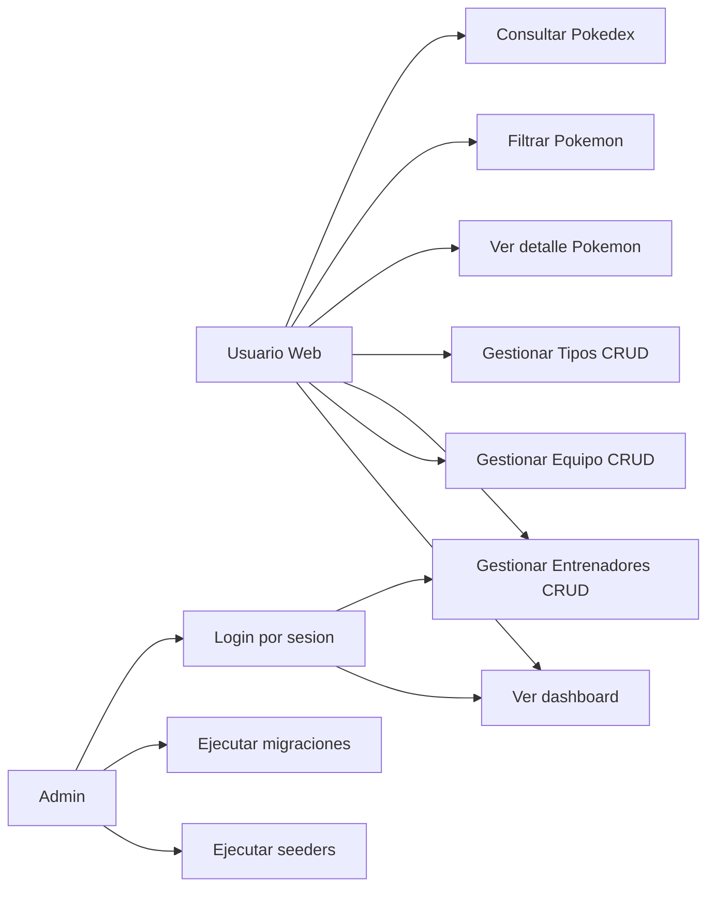
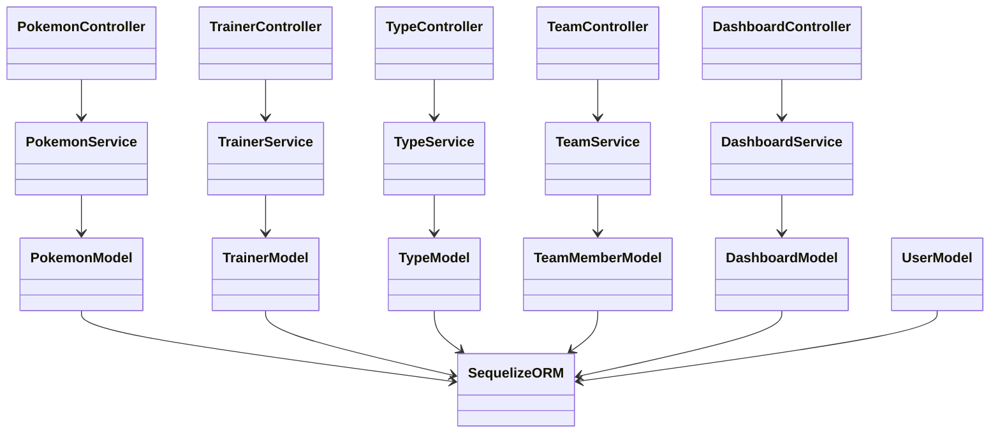
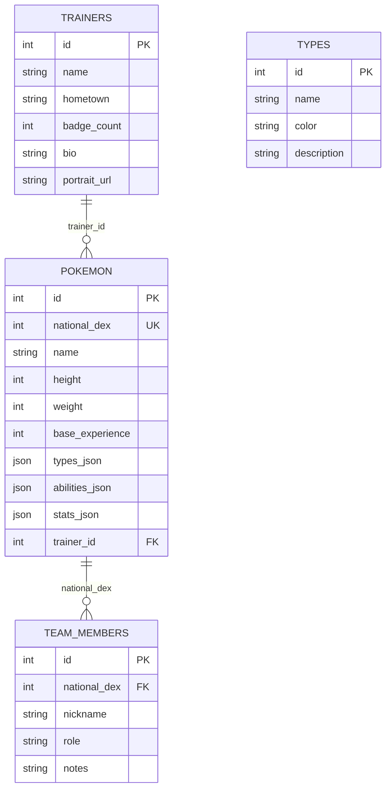

# Poke Team Lab

Full-stack application inspired by the original Gen I Pokedex, built with a REST API, MySQL, and a React frontend.

## What is included

- Node.js + Express backend with CRUD for Pokemon, Trainers, Types, and Team.
- MySQL 8 database with migrations and seeders.
- Gen I Pokemon importer from PokeAPI.
- React + Vite frontend with routes for Pokedex, Team Builder, Trainer Profiles, and Type Insights.
- Docker Compose setup for local MySQL.

## Tech stack

| Layer | Technologies |
|------|-------------|
| Backend | Node.js 18+, Express 5, Sequelize ORM, mysql2, dotenv, cors |
| Frontend | React 19, React Router 7, Vite 7 |
| Database | MySQL 8 (Docker) |
| Testing | Jest + Supertest (backend, partial coverage) |

## Requirements

- Node.js 18 or newer
- npm 10+
- Docker Desktop (recommended for MySQL)

## Quick start

1. Install dependencies:

```bash
npm install --prefix backend
npm install --prefix frontend
```

2. Start MySQL with Docker:

```bash
docker compose up -d mysql
```

3. Configure environment variables:

- Copy backend/.env.example to backend/.env.
- Adjust credentials if you changed docker-compose.yml.
- Optional flags:
  - DB_AUTO_MIGRATE=true
  - DB_AUTO_SEED=true

4. Run migrations and seeders (if auto-setup is disabled):

```bash
cd backend
npm run migrate
npm run seed
```

5. Start backend:

```bash
npm start
```

API available at http://localhost:4000.

6. Start frontend:

```bash
cd ../frontend
npm run dev
```

App available at http://localhost:5173.

## Available scripts

### Backend (backend folder)

- npm start: starts the API server.
- npm test: runs Jest tests.
- npm run migrate: applies migrations.
- npm run migrate:down: rolls back migrations.
- npm run seed: runs seeders.

Note: this project does not define npm run dev in backend.

### Frontend (frontend folder)

- npm run dev: starts Vite development server.
- npm run build: builds for production.
- npm run preview: previews the production build.
- npm run lint: runs ESLint.

## REST API

Base URL: http://localhost:4000

Health check:
- GET /health

### Pokemon

- GET /api/pokemon
- GET /api/pokemon/:nationalDex
- POST /api/pokemon
- PUT /api/pokemon/:nationalDex
- DELETE /api/pokemon/:nationalDex

GET /api/pokemon query filters:
- search
- type
- types[]
- limit
- offset

Example POST/PUT Pokemon body:

```json
{
  "nationalDex": 25,
  "name": "pikachu",
  "height": 4,
  "weight": 60,
  "baseExperience": 112,
  "spriteUrl": "https://raw.githubusercontent.com/PokeAPI/sprites/master/sprites/pokemon/25.png",
  "types": ["electric"],
  "abilities": [{ "name": "static", "isHidden": false }],
  "stats": [{ "name": "speed", "base": 90 }],
  "trainerId": 1
}
```

### Trainers

- GET /api/trainers
- POST /api/trainers
- PUT /api/trainers/:id
- DELETE /api/trainers/:id

Example POST/PUT Trainer body:

```json
{
  "name": "Misty",
  "hometown": "Cerulean City",
  "badgeCount": 4,
  "bio": "Water specialist",
  "portraitUrl": "/trainers/misty.png"
}
```

### Types

- GET /api/types
- POST /api/types
- PUT /api/types/:id
- DELETE /api/types/:id

Example POST/PUT Type body:

```json
{
  "name": "fire",
  "color": "#EE8130",
  "description": "Specializes in offense"
}
```

### Team

- GET /api/team
- POST /api/team
- PUT /api/team/:id
- DELETE /api/team/:id

Team business rules:
- Maximum of 6 members.
- nationalDex is required and must be between 1 and 151.
- The Pokemon must exist in the local Pokedex.

Example POST/PUT Team member body:

```json
{
  "nationalDex": 25,
  "nickname": "Sparky",
  "role": "sweeper",
  "notes": "Lead with Thunderbolt"
}
```

### Response format

- Success with payload: { "data": ... }
- Error: { "message": "..." }
- Successful DELETE: HTTP 204 with no body

## Security Update Implemented

This repository now includes a simple authentication and authorization layer for two CRUD modules: Trainers and Types.

### What was implemented

- Dual authentication support:
      - Basic authentication using Base64 credentials in the Authorization header.
      - Bearer authentication using JWT tokens issued by a login endpoint.
- Encrypted passwords in database using bcrypt hashes (no plain text passwords stored).
- Role-based authorization:
      - admin: full CRUD access.
      - trainer: read-only access to protected CRUD endpoints.
- Protected endpoints:
      - /api/trainers
      - /api/types

### Where the changes were made

- Auth route and controller:
      - backend/src/routes/auth.routes.js
      - backend/src/controllers/authController.js
- Auth service and middleware:
      - backend/src/services/authService.js
      - backend/src/middlewares/authMiddleware.js
- User model and data persistence:
      - backend/src/models/user.js
      - backend/src/database/migrations/007_create_users_table.js
      - backend/src/database/seeders/004_users_seeder.js
      - backend/src/database/runMigrations.js
      - backend/src/database/runSeeders.js
- Backend bootstrapping and route wiring:
      - backend/server.js
- Protected CRUD routes:
      - backend/src/routes/trainer.routes.js
      - backend/src/routes/type.routes.js
- Environment and dependency updates:
      - backend/.env.example
      - backend/package.json
      - backend/package-lock.json

### How it was implemented

1. Added a users table with username, password_hash, and role.
2. Seeded demo users with bcrypt-hashed passwords.
3. Implemented login endpoint to validate credentials and issue JWT.
4. Built a middleware that accepts both Basic and Bearer schemes.
5. Applied role checks at route level for Trainers and Types CRUD endpoints.
6. Documented usage and endpoint behavior in backend README.

### Verification performed

- Basic auth access to protected GET endpoints works.
- Bearer token access works after login.
- Role restrictions are enforced (trainer receives HTTP 403 on protected write operations).

## Tests

Automated CRUD tests exist for Types in backend/tests/types.crud.test.js.

Run:

```bash
cd backend
npm test
```

## Project structure

```text
backend/              Express API, models, services, migrations, and seeders
frontend/             React app with Vite
docs/                 Additional documentation
docker-compose.yml    Local MySQL with Docker
```

## Additional documentation

- docs/casos-de-uso.md
- docs/clases.md
- docs/entidad-relacion.md
- docs/diagrams.md

## New features and how to verify them (notifications, auth, dev)

These steps cover the most recent enhancements: browser push notifications (Service Worker), a global activity listener via Socket.IO, JWT Bearer authentication, and development conveniences for Vite.

1. Install dependencies (if not already done):

```bash
npm install --prefix backend
npm install --prefix frontend
```

2. Start MySQL with Docker:

```bash
docker compose up -d
```

3. Backend environment variables:

- Copy `backend/.env.example` to `backend/.env` and adjust if needed (DB_HOST, DB_PORT, DB_USER, DB_PASSWORD, CLIENT_ORIGINS). For local development with Vite you don't need to list specific ports; the server accepts `http://localhost:<port>` origins.

4. Run migrations and seeders (optional if `DB_AUTO_MIGRATE=true`):

```bash
cd backend
npm run migrate
npm run seed
```

5. Start backend API:

```bash
cd backend
npm start
# API available at http://localhost:4000
```

6. Start frontend (Vite):

```bash
cd frontend
npm run dev
# Vite may pick an alternate port if 5173 is in use (e.g. 5175)
```

7. Enable browser notifications:

- Open the app in your browser (e.g. `http://localhost:5175` or `5173`).
- Go to the `Live Activity` panel on the `Dashboard` and click the `Enable notifications` button (the app will request Notification permission).
- The Service Worker registers automatically from `/notification-sw.js`.

8. Test push notifications:

- From the UI create a new `Type` in `Type Insights` with a valid `name` (letters and hyphens only) and a valid `color` (hex).
- When created, the backend emits an `activity` event; the client will call `registration.showNotification(...)` (if the SW is registered) or fall back to an in-page `Notification`.

9. Technical notes:

- Service Worker: `frontend/public/notification-sw.js` (handles `notificationclick` to focus/open `/dashboard`).
- Global listener: `frontend/src/services/globalNotifications.js` (started from `main.jsx`) — listens for `activity` via Socket.IO and shows notifications even when `LiveActivityFeed` is not mounted.
- Live component: `frontend/src/components/realtime/LiveActivityFeed.jsx` — shows recent events and has buttons to enable/test notifications.
- Auth: `backend/src/middlewares/authMiddleware.js` (Bearer JWT). Protected routes include `trainer.routes.js` and `dashboard.routes.js` (you can apply `authenticate` to other routes if desired).

10. Run backend tests:

```bash
cd backend
npm test
```

If you want, I can also generate a Postman collection with the protected endpoints (login + CRUDs) and add it to the repository.


## Diagramas (renderizados en README)

### Casos de uso



### Diagrama de clases (backend)



### Entidad-relación


