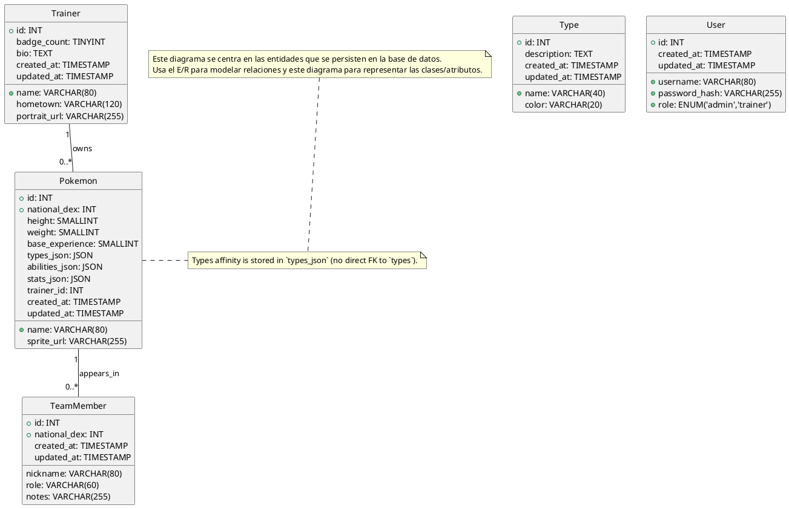

# Diagrama de Clases (arquitectura backend)

```plantuml
@startuml
skinparam shadowing false
hide circle

' Diagrama de clases — entidades persistentes (coherente con E/R)
class Type {
    +id: INT
    +name: VARCHAR(40)
    color: VARCHAR(20)
    description: TEXT
    created_at: TIMESTAMP
    updated_at: TIMESTAMP
}

class Trainer {
    +id: INT
    +name: VARCHAR(80)
    hometown: VARCHAR(120)
    badge_count: TINYINT
    bio: TEXT
    portrait_url: VARCHAR(255)
    created_at: TIMESTAMP
    updated_at: TIMESTAMP
}

class Pokemon {
    +id: INT
    +national_dex: INT
    +name: VARCHAR(80)
    height: SMALLINT
    weight: SMALLINT
    base_experience: SMALLINT
    sprite_url: VARCHAR(255)
    types_json: JSON
    abilities_json: JSON
    stats_json: JSON
    trainer_id: INT
    created_at: TIMESTAMP
    updated_at: TIMESTAMP
}

class TeamMember {
    +id: INT
    +national_dex: INT
    nickname: VARCHAR(80)
    role: VARCHAR(60)
    notes: VARCHAR(255)
    created_at: TIMESTAMP
    updated_at: TIMESTAMP
}

class User {
    +id: INT
    +username: VARCHAR(80)
    +password_hash: VARCHAR(255)
    +role: ENUM('admin','trainer')
    created_at: TIMESTAMP
    updated_at: TIMESTAMP
}

Trainer "1" -- "0..*" Pokemon : owns
Pokemon "1" -- "0..*" TeamMember : appears_in

note right of Pokemon
Types affinity is stored in `types_json` (no direct FK to `types`).
end note

note top
Este diagrama se centra en las entidades que se persisten en la base de datos.
Usa el E/R para modelar relaciones y este diagrama para representar las clases/atributos.
end note

@enduml
```
