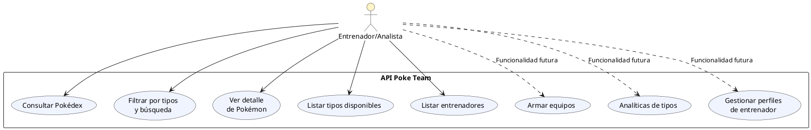
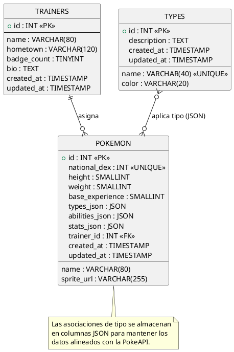

```plantuml
@startuml
skinparam backgroundColor #FFFFFF
skinparam usecase {
    BackgroundColor #F0F4FF
}

actor "Entrenador/Analista" as User #FFF3C7

rectangle "API Poke Team" {
    usecase UC_Pokedex as "Consultar Pokédex"
    usecase UC_Filter as "Filtrar por tipos\ny búsqueda"
    usecase UC_Profile as "Ver detalle\nde Pokémon"
    usecase UC_Types as "Listar tipos disponibles"
    usecase UC_Trainers as "Listar entrenadores"
    usecase UC_TeamBuilder as "Armar equipos"
    usecase UC_TypeInsights as "Analíticas de tipos"
    usecase UC_TrainerMgmt as "Gestionar perfiles\nde entrenador"
}

User --> UC_Pokedex
User --> UC_Filter
User --> UC_Profile
User --> UC_Types
User --> UC_Trainers
User ..> UC_TeamBuilder : "Funcionalidad futura"
User ..> UC_TypeInsights : "Funcionalidad futura"
User ..> UC_TrainerMgmt : "Funcionalidad futura"

@enduml
```

```plantuml
@startuml
hide circle
skinparam entity {
    BackgroundColor #F8FAFC
    BorderColor #1E293B
}

entity "TRAINERS" as trainers {
    + id : INT <<PK>>
    --
    name : VARCHAR(80)
    hometown : VARCHAR(120)
    badge_count : TINYINT
    bio : TEXT
    created_at : TIMESTAMP
    updated_at : TIMESTAMP
}

entity "POKEMON" as pokemon {
    + id : INT <<PK>>
    national_dex : INT <<UNIQUE>>
    name : VARCHAR(80)
    height : SMALLINT
    weight : SMALLINT
    base_experience : SMALLINT
    sprite_url : VARCHAR(255)
    types_json : JSON
    abilities_json : JSON
    stats_json : JSON
    trainer_id : INT <<FK>>
    created_at : TIMESTAMP
    updated_at : TIMESTAMP
}

entity "TYPES" as types {
    + id : INT <<PK>>
    name : VARCHAR(40) <<UNIQUE>>
    color : VARCHAR(20)
    description : TEXT
    created_at : TIMESTAMP
    updated_at : TIMESTAMP
}

trainers ||--o{ pokemon : "asigna"
types }o--o{ pokemon : "aplica tipo (JSON)"

note bottom of pokemon
    Las asociaciones de tipo se almacenan
    en columnas JSON para mantener los
    datos alineados con la PokeAPI.
end note
@enduml
```

