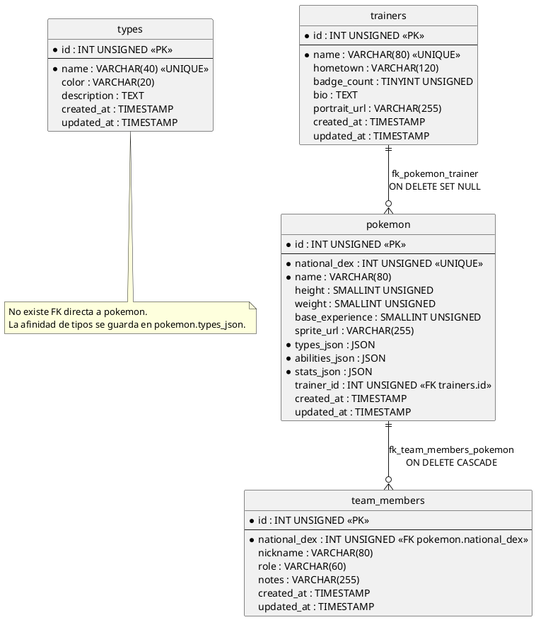

# Diagrama Entidad-Relación

```plantuml
@startuml
hide circle
skinparam shadowing false

entity "types" as types {
    * id : INT UNSIGNED <<PK>>
    --
    * name : VARCHAR(40) <<UNIQUE>>
    color : VARCHAR(20)
    description : TEXT
    created_at : TIMESTAMP
    updated_at : TIMESTAMP
}

entity "trainers" as trainers {
    * id : INT UNSIGNED <<PK>>
    --
    * name : VARCHAR(80) <<UNIQUE>>
    hometown : VARCHAR(120)
    badge_count : TINYINT UNSIGNED
    bio : TEXT
    portrait_url : VARCHAR(255)
    created_at : TIMESTAMP
    updated_at : TIMESTAMP
}

entity "pokemon" as pokemon {
    * id : INT UNSIGNED <<PK>>
    --
    * national_dex : INT UNSIGNED <<UNIQUE>>
    * name : VARCHAR(80)
    height : SMALLINT UNSIGNED
    weight : SMALLINT UNSIGNED
    base_experience : SMALLINT UNSIGNED
    sprite_url : VARCHAR(255)
    * types_json : JSON
    * abilities_json : JSON
    * stats_json : JSON
    trainer_id : INT UNSIGNED <<FK trainers.id>>
    created_at : TIMESTAMP
    updated_at : TIMESTAMP
}

entity "team_members" as team_members {
    * id : INT UNSIGNED <<PK>>
    --
    * national_dex : INT UNSIGNED <<FK pokemon.national_dex>>
    nickname : VARCHAR(80)
    role : VARCHAR(60)
    notes : VARCHAR(255)
    created_at : TIMESTAMP
    updated_at : TIMESTAMP
}

trainers ||--o{ pokemon : "fk_pokemon_trainer\nON DELETE SET NULL"
pokemon ||--o{ team_members : "fk_team_members_pokemon\nON DELETE CASCADE"

note bottom of types
No existe FK directa a pokemon.
La afinidad de tipos se guarda en pokemon.types_json.
end note
@enduml
```
